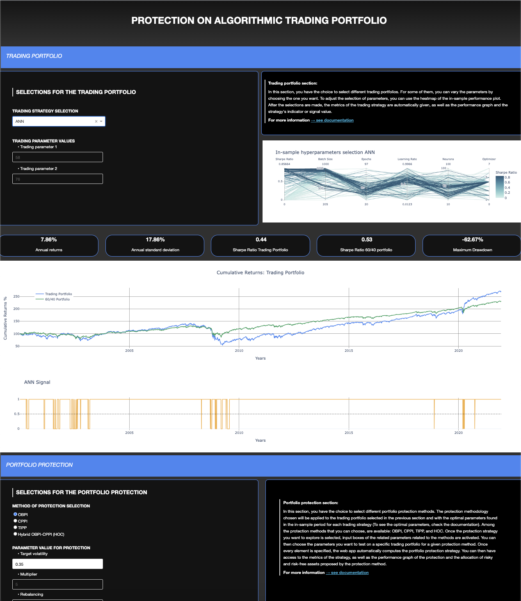

# Trading Portfolio Protection

 

## Master Thesis: Trading Portfolio Protection GitHub Repository 

###### Webapp link: https://algotradingportfolioprotection.pythonanywhere.com/
###### Google Colab Jupyter Notebook:  

 

## Summary of the repository:
  1. [→ Webapp Dashboard ←](Webapp_Dashboard)
     - Use the Webapp
     - Deploy locally the Webapp
     - Data
  2. [→ Jupyter Notebook ←](Jupyter_Notebook)
     - Google Colab (Cloud Notebook)
     - Jupyter Notebook File 
     - Data  
  3. [→ Aditional Components /!\ In construction /!\ ←](Jupyter_Notebook)
     - Results Tables 
     - Results Graphs 
     - Master Thesis  

 

## Overview of the webapp

